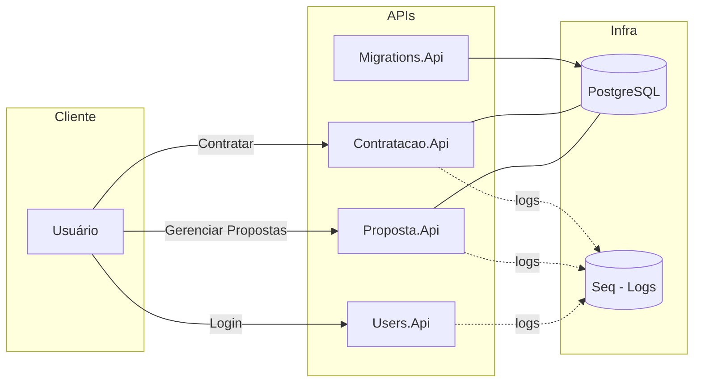
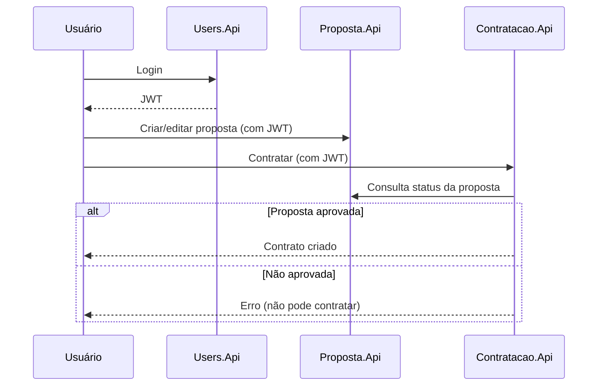

# Desafio – Gestão de Propostas e Contratação

## Visão Geral:
- 3 APIs principais: `Users` (login/JWT), `Proposta` (propostas) e `Contratacao` (contratos).
- Banco: PostgreSQL. Observabilidade básica: Seq (logs estruturados).
- Arquitetura: separação por camadas e domínios (DDD/Clean/Hexagonal) — detalhes no fim.

## Mapa da Solução



## Fluxo Rápido (como funciona)



## Como executar (modo simples com Docker)
1) Pré‑requisitos: Docker e Docker Compose instalados.
2) Variáveis: crie um arquivo `.env` na raiz (exemplo):
```
DB_HOST=postgres
DB_PORT=5432
DB_NAME=desafio
DB_USER=postgres
DB_PASSWORD=postgres
ASPNETCORE_ENVIRONMENT=Development
JWT_ISSUER=local
JWT_AUDIENCE=local
JWT_SECRET=supersecret_local_123
```
3) Subir tudo:
- docker compose up -d


4) Acessos rápidos:
- Swagger Users: http://localhost:5095/swagger
- Swagger Proposta: http://localhost:5002/swagger
- Swagger Contratação: http://localhost:5003/swagger
- Seq (logs): http://localhost:5341
- Postgres: localhost:5432 (credenciais do `.env`)

Observação: as migrations são aplicadas pela `Migrations.Api` quando o compose sobe.

## Logs Serilog.Seq -> http://localhost:5341/#/events?range=1d


## Domínio
- Proposta
  - Estados: EmAnálise → Aprovada/Rejeitada → (se aprovada) Contratada
  - Regras: só aprova/rejeita se EmAnálise; só contrata se Aprovada
- Contrato
  - Regras: cancelar exige motivo; encerrar apenas se ativo; vigência válida

Por que isso importa? As regras vivem no domínio para manter consistência do negócio e facilitar testes.


## Endpoints principais (exemplos)
- Proposta
  - GET /api/Proposta/{externalId}
  - POST /api/Proposta
  - PUT /api/Proposta/{externalId}
- Contratação
  - POST /api/Contrato/proposta/{propostaExternalId}/contratar
  - GET /api/Contrato/{externalId}

Use os Swagger das APIs para explorar todos os endpoints.


## Segurança e Observabilidade
- JWT Bearer nas APIs (Issuer, Audience, Secret via configuração).
- Logs estruturados no Seq (sem autenticação no ambiente local do compose para facilitar).


## Estrutura (visão rápida)
```
src/
  Proposta/ (Api, Application, Domain, Infra.Data, Infra.IoC)
  Contratacao/ (Api, Application, Domain, Infra.Data, Infra.IoC)
  Users/ (Api, Identity, Domain, Application, Infra.Data, Infra.IoC)
  Core/ e CrossCutting/ (compartilhados: DTO, IoC, Log, Data, etc.)
Migrations/ (Migrations.Api)
docker-compose.yaml
```


## Para técnicos (detalhes)
- Padrões e camadas
  - DDD + Clean + Hexagonal; portas/adapters por HTTP e repositórios
  - `*.Domain`: entidades ricas, comandos, eventos, specifications
  - `*.Application`: orquestra casos de uso, MediatR para comandos/eventos
  - `*.Infra.Data`: EF Core (Npgsql), repositórios, migrations
  - `*.Infra.IoC`: composição de dependências
- Persistência
  - Contextos: `Proposta.Infra.Data` e `Contratacao.Infra.Data`
  - Migrations aplicadas pela `Migrations.Api` no startup
- Comunicação entre serviços
  - REST entre `Contratacao` e `Proposta` (consulta status antes de contratar)
- Testes
  - `tests/FunctionalTests` com `WebApplicationFactory`

Links úteis no código (busque pelos projetos):
- `Proposta.Domain` e `Contratacao.Domain` (regras)
- `Proposta.Api` e `Contratacao.Api` (controllers e Swagger)
- `CrossCutting.Infra.Log` (logging/Serilog)


## Testes Funcionais

